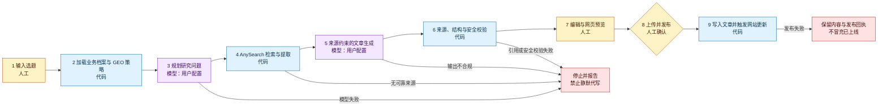
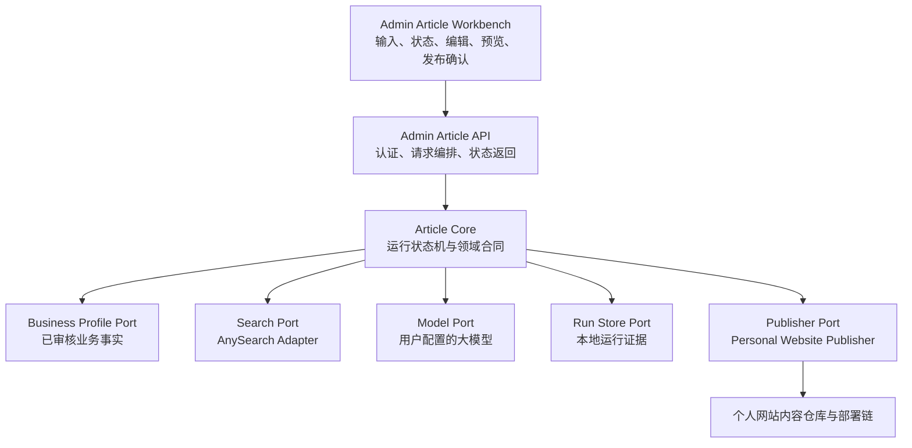

# 网站业务文章与本地文章工作台设计

> 历史实施记录：仅用于追溯该子系统的设计与验收背景，不是当前品牌或视觉权威；当前实现以代码、`DESIGN.md`、`docs/architecture.md` 和 `docs/PROJECT-STATE.md` 为准。

日期：2026-08-09
状态：已确认的指导设计，尚未实施

## 1. 目标

把网站文章区从与当前业务弱相关的《Hello Agents》教程集合，调整为面向真实潜在客户的业务内容入口，并在现有本地 Admin Workbench 中增加一条简单、可核验的文章生产链：

> 输入选题 → 规划研究 → AnySearch 检索 → 来源包 → 大模型生成 → 人工编辑与网页预览 → 上传并直接发布

文章首先服务于已经存在重复流程、正在评估 AI 自动化的中小企业负责人和运营负责人。GEO 是内容被传统搜索、AI 搜索和爬虫发现、理解、引用与衡量的方法，不是文章区唯一或主要的选题方向。

一期完成后，用户能够：

- 维护一次性的真实业务事实档案；
- 输入一个业务问题并生成一篇有公开来源支撑的网页文章；
- 在发布前编辑正文并预览真实网页效果；
- 点击一次“上传并发布”，直接进入网站发布流程；
- 获得可核验的检索、模型、校验和发布结果。

一期采用“管理台入口、可抽离内核”的架构：用户直接在现有本地 Admin Workbench 中使用文章功能，但研究、生成、校验和发布能力不写进页面组件，也不硬编码个人网站业务。它们组成仓库内独立的 Article Core，由管理台调用。未来只有在真实使用证明商业需求后，才把 Article Core 抽到独立产品。

## 2. 非目标

一期不做：

- 草稿箱、审批队列、多人协作或二次发布确认；
- 定时批量生成、每日固定篇数或无人值守发布；
- 公众号排版、微信公众号草稿、配图、Obsidian 投影或 AI HOT 选题；
- 自动学习用户偏好、自动改写历史文章或流量驱动的自动发文；
- 为了搜索覆盖而批量生成同质化页面；
- 在本轮设计工作中删除旧文章、调用真实模型、写入 GitHub、触发部署或发布内容；
- 在一期内完成独立商业产品、多租户、计费、团队权限或第三方 CMS 适配。

独立商业产品是二期方向。个人网站一期应保持模块边界清晰，但不提前承担 SaaS 平台复杂度。

## 3. 当前基线

设计时仓库的事实基线如下：

- `/articles` 当前公开《Hello Agents》前言和 16 章；
- 每个 MDX 包装文件正文几乎只有一句外链说明，实际内容位于独立静态 HTML；
- 文章同时进入 sitemap、RSS、JSON Feed、`llms.txt` 和 AI 可读路由；
- 现有 Admin Workbench 只在非生产环境且 `ENABLE_ADMIN=true` 时开放；
- 现有通用保存接口只允许更新指定 JSON 配置，通过 GitHub Contents API 写入仓库，并包含旧的 Vercel 触发逻辑；
- 现有公开业务事实分散在 `public-identity`、`service-method`、公开项目配置和已审核项目事实中；
- 现有文章自动化项目 `E:\project\ai-daily-article-automation` 提供来源绑定、模型调用回执、结构化校验和失败关闭方面的参考，但其公众号渠道职责不属于本项目。

实施前必须重新核验当前分支、HEAD、脏工作树、部署平台和上述文件状态。本设计不把 2026-08-09 的仓库快照当作永久运行事实。

## 4. 内容定位

### 4.1 编辑原则

每篇文章从一个客户真实会遇到的业务问题出发，而不是从技术名词或搜索关键词出发。文章应帮助读者完成一个判断，例如：

- 这个流程是否值得自动化；
- 应该从哪里开始；
- AI、普通自动化和人工处理各自承担什么；
- 怎样判断 Demo 能否成为可运行的业务系统；
- 供应商应交付什么；
- 哪些步骤必须保留人工审核和失败处理。

首批建议形成五篇连续的客户问题集群：

1. 《你的业务流程，真的适合用 AI 自动化吗？》
2. 《从 Excel、邮件和人工跟进开始，企业如何逐步接入 AI？》
3. 《为什么很多 AI Demo 无法成为真正可用的业务系统？》
4. 《定制 AI 自动化项目应该交付什么？》
5. 《AI 自动化必须保留哪些人工审核和失败处理？》

这五篇覆盖“识别问题 → 判断适用性 → 理解实施 → 评估交付 → 建立风险信任”的客户决策过程。每篇可以独立阅读，并自然链接到相关案例、下一篇文章、服务页和联系入口。

### 4.2 单篇文章信息结构

单篇文章采用共同的信息骨架，但不强制生成相同的小标题、段落数或篇幅：

1. 标题使用客户真实会问的问题；
2. 开头尽快给出直接答案；
3. 描述问题出现的具体业务场景；
4. 给出判断标准、检查清单或决策框架；
5. 说明可执行的实施路径；
6. 引用公开事实和可公开的项目证据；
7. 明确风险、边界和不适用场景；
8. 在确有必要时回答常见问题；
9. 自然链接到相关案例、服务或联系入口。

正文必须作为站内可直接抓取的语义化 HTML 输出，不再使用“一句 MDX 简介再跳转独立 HTML”的双层内容结构。

## 5. 真实业务事实档案

### 5.1 事实权威

业务事实必须真实，最终权威属于用户和经过审核的项目事实，不属于大模型。

本地工作台提供一次性“业务事实档案”设置页。默认从现有公开配置读取并形成可审查视图：

- 品牌身份与定位；
- 目标客户；
- 适合解决的业务问题；
- 服务方法与交付物；
- 明确边界和不承诺事项；
- 可公开项目案例与证据；
- 作者身份、联系入口和行动提示；
- 禁止生成的陈述，例如虚构客户、指标、结果、证言或能力。

业务事实档案的修改必须由用户主动保存。大模型只读取已确认的投影，不能改写权威事实。

### 5.2 单篇文章输入

正常生成一篇文章时，必填项只有：

- 一个业务问题或选题。

可选项包括：

- 期望帮助读者完成的判断；
- 用户自己的实践观察；
- 可以公开的内部事实或案例补充；
- 不希望文章讨论的内容。

如果没有实践补充，文章可以是来源约束的业务分析，但不得冒充用户亲历。客户身份、内部数字、真实结果和第一人称经历只有在用户明确提供并允许公开时才能使用。

## 6. GEO 内容与技术策略

### 6.1 设计依据

GEO 不作为一种独立于 SEO 的固定写作模板。官方资料支持以下边界：

- Google 表示 AI Overviews 和 AI Mode 没有额外的特殊技术要求；页面首先要可抓取、已索引并符合显示摘要的条件。重要内容应以文本提供，内部链接应可发现，结构化数据应与可见文本一致：<https://developers.google.com/search/docs/appearance/ai-features>
- Google 强调独特、非同质化、以用户为中心的内容，并警告不要使用生成式 AI 批量制造没有新增价值的页面：<https://developers.google.com/search/docs/fundamentals/ai-optimization-guide>
- OpenAI 将用于 ChatGPT 搜索展示的 `OAI-SearchBot` 与用于基础模型训练的 `GPTBot` 分开控制：<https://platform.openai.com/docs/bots>
- Bing Webmaster Tools 的 AI Performance 已提供引用次数、被引用页面和 grounding queries 等指标，并建议加强内容深度、结构、证据、时效性和跨格式一致性：<https://blogs.bing.com/webmaster/February-2026/Introducing-AI-Performance-in-Bing-Webmaster-Tools-Public-Preview>
- Google 的 `Article`/`BlogPosting` 结构化数据可帮助搜索系统理解标题、作者、图片和发布日期：<https://developers.google.com/search/docs/appearance/structured-data/article>

### 6.2 系统级策略

每篇文章应满足六层策略：

1. **业务意图**：回答一个真实客户问题；
2. **原创价值**：加入用户的判断框架、项目实践或明确边界，而不是只复述来源；
3. **可核验依据**：关键事实绑定可打开的原始来源；
4. **可读和可引用**：直接回答、清晰标题、自然段落，适合时使用表格或 FAQ；
5. **技术可发现性**：正文 HTML、canonical、内部链接、sitemap、Feed、`BlogPosting` JSON-LD 和一致元数据；
6. **真实效果衡量**：观察搜索访问、AI 引用、爬虫访问、文章到案例/服务/联系页的点击和最终转化。

`llms.txt` 是辅助发现面，不替代可抓取正文、标准索引、内部链接、结构化数据和内容质量。不得为了“适合 AI”机械增加 FAQ、表格、短段落或关键词。

## 7. AnySearch 研究与来源包

### 7.1 研究流程

每篇文章建立独立、可回查的来源包：

1. 大模型根据选题和业务目标规划研究问题与搜索查询；
2. 代码调用 AnySearch 执行搜索和原文提取；
3. 代码为本次返回的来源分配稳定来源 ID，并保留原始标题、URL、发布日期、提取时间和提取状态；
4. 大模型根据来源内容选择证据、冲突观点和不确定性；
5. 代码校验所有证据和文章引用必须绑定到本次来源 ID；
6. 任一关键事实缺少可回查来源时，删除、弱化或明确标注为经验判断。

不得把密码、个人数据、商业秘密或未经许可的客户信息发送给 AnySearch。

### 7.2 来源标准

- 原则上每篇使用 4–8 个有效来源；
- 至少 2 个不同来源由模型基于已提取全文分类为官方机构、标准组织、原始研究或同行评审候选，并在发布前由用户明确确认；代码只校验来源 ID、分类合同和确认状态，不用域名关键词猜测权威性；
- 厂商和行业报告可以补充趋势，但不能独立证明普遍结论；
- 比例、成本、采用率、失败率和其他数字必须有直接来源；
- 搜索摘要不能作为最终事实依据，必须读取可用原文；
- 来源无法打开、内容不支持论点或彼此冲突时，文章不得把该论点写成确定事实；
- 自有项目证据与外部行业来源分开标识。

正文中的关键事实使用简洁引用标记，例如 `[1]`。文章尾部提供“参考来源”，列出标题、发布机构、日期和原始可点击链接；另设“相关项目证据”连接到站内已审核案例。

## 8. 模型、代码与人工边界



| 关键节点 | 用户可见结果 | 执行者 | 代码边界 | 失败行为 | 证据 |
|---|---|---|---|---|---|
| 业务事实加载 | 文章使用当前已确认定位 | 代码 | 读取并投影权威配置，不补写业务含义 | 缺失时停止生成 | 业务档案版本与哈希 |
| 研究规划 | 得到与选题相关的研究问题 | 外接模型 | 校验数量、长度和格式，不用关键词规则代替 | 模型失败即停止 | provider、model、合同版本、响应 ID/哈希 |
| 公开材料检索 | 得到可回查来源 | 代码 + AnySearch | 拥有 URL、来源 ID、提取状态、限制和网络传输 | 无来源或提取失败即停止 | 原始返回、来源清单、提取时间 |
| 文章生成 | 得到标题、摘要、正文与引用 | 外接模型 | 不替模型决定论点、结构和表达 | 输出不合规即停止 | 模型回执与原始响应 |
| 硬校验 | 显示可发布或明确问题 | 代码 | 校验引用绑定、元数据、Markdown、安全和硬限制 | 不通过时禁止发布 | 校验回执 |
| 编辑预览 | 用户看到真实网页效果 | 人工 | 机械保存当前工作状态，不自动批准 | 未确认时不发布 | 最终内容哈希 |
| 上传并发布 | 网站产生规范文章 URL | 人工 + 代码 | 显式确认后执行一次幂等发布 | 失败时保留内容并返回真实状态 | Git/发布回执和最终 URL |

模型负责语义理解、研究规划、证据取舍、判断、标题、结构和正文。代码负责权威事实身份、来源 ID、原始 URL、schema、硬限制、权限、临时保存、发布和回执。禁止代码在模型不可用时通过关键词、模板、旧文章或缓存正文生成一个看似成功的替代结果。

## 9. 本地文章工作台

### 9.1 页面范围

在现有 Admin Workbench 中新增“文章”入口，包含三个简单界面：

1. **业务事实档案**：查看和维护可进入文章生成的真实业务事实；
2. **生成文章**：输入选题和可选实践补充，观察研究、来源和生成状态；
3. **编辑与预览**：同屏编辑正文、检查来源、查看网页预览并点击“上传并发布”。

实施 UI 前必须先更新项目根目录 `DESIGN.md`，并按现有视觉系统完成桌面和移动截图检查。

### 9.2 工作状态而非草稿箱

系统可以在仓库忽略的 `output/article-workbench/<run-id>/` 中保存当前运行的输入、来源包、模型回执、生成结果和最终内容哈希，用于刷新恢复、错误诊断和幂等校验。

这些文件是运行证据，不构成草稿箱：

- 没有草稿列表、审批状态或待发布队列；
- 用户打开当前运行即可继续编辑；
- 点击“上传并发布”就是唯一发布确认；
- 生成完成不会自动发布；
- 发布失败不会自动重试或声称成功。

### 9.3 架构决策：管理台入口，可抽离内核

一期不创建新仓库、不启动独立 SaaS，也不把生成逻辑直接塞进 Admin 页面。采用第三种折中架构：

| 方案 | 优点 | 主要问题 | 决定 |
|---|---|---|---|
| 全部直接写进现有 Admin 页面和 API | 首次开发最快 | 页面、个人业务、模型和发布耦合，后续难以复用 | 不采用 |
| 现在就做独立商业产品 | 边界看起来完整 | 过早承担账号、租户、计费、密钥和多 CMS 复杂度 | 不采用 |
| Admin 作为入口，仓库内 Article Core 独立 | 能立即自用，并保留可抽离合同 | 需要从一期开始维持清晰接口 | 采用 |



#### Article Core

Article Core 是一期的领域内核，负责：

- 接收选题、业务事实投影和可选实践补充；
- 驱动 `research_planned → sources_ready → article_generated → validated → publish_submitted → published` 的正常状态；
- 在任一步产生类型化失败并停止后续动作；
- 构造模型和适配器请求，但不持有 UI、HTTP Cookie、Next.js 页面或个人网站文案；
- 只通过端口读取业务事实、调用搜索/模型、保存运行证据和发布文章。

`article_generated` 是当前工作结果，不是草稿箱状态。用户在预览页点击“上传并发布”是一次瞬时命令，不是持久状态。代码把文章写入规范仓库后进入 `publish_submitted`；该状态不要求第二次人工确认。只有公开规范 URL 的内容哈希与本次最终内容一致时才进入 `published`。

#### 管理台 UI 与 API

Admin Article Workbench 负责输入、进度、来源检查、正文编辑、预览和最终发布按钮。页面不直接调用 AnySearch、模型或 GitHub。

Admin Article API 继续使用现有本地 Admin 认证边界，负责：

- 校验认证和请求大小；
- 调用 Article Core；
- 将运行状态安全地投影给页面；
- 不向浏览器返回模型密钥、AnySearch 密钥、GitHub 凭据或未经清理的原始响应；
- 不绕过 Core 直接写文章文件或发布。

#### 可替换端口

一期定义最小接口，不建立插件市场或通用工作流引擎：

- `BusinessProfilePort`：返回已审核、带版本和哈希的业务事实投影；
- `SearchPort`：接收研究查询，返回代码拥有的来源 ID、原始 URL 和提取内容；
- `ModelPort`：执行研究规划和来源约束写作，返回模型回执；
- `RunStorePort`：保存当前 run-owned 工件、内容指纹和失败回执；
- `PublisherPort`：接收最终文章包并返回规范 URL、内容身份和发布状态。

个人网站一期只实现：

- 现有公开配置驱动的 `PersonalWebsiteBusinessProfile`；
- `AnySearchAdapter`；
- 一个实现 `ModelPort` 的可替换模型适配器；首个配置使用 OpenCode Zen Go、`deepseek-v4-flash`、`https://opencode.ai/zen/go/v1` 和 `prompt_only` 结构化输出；
- 本地忽略目录驱动的运行存储；
- `WebsitePublisher`。

模型 provider、model ID、base URL、鉴权和结构化输出能力必须来自服务端配置，不能进入工作流核心判断。不得为了未来产品化同时实现第二个模型、第二个搜索引擎或第二个 CMS。可替换性由 `ModelPort`、能力配置和替身测试证明，不由一期适配器数量证明。

#### 建议代码边界

实施计划可以按当前 Next.js/TypeScript 架构采用以下逻辑边界；确切文件名在实施前以当前仓库为准：

```text
app/admin/(dashboard)/articles/        管理台文章页面
app/api/admin/articles/                受保护的文章 API
components/admin/articles/             输入、状态、来源、编辑和预览组件
lib/article-workbench/core/             与 Next.js UI 解耦的状态与合同
lib/article-workbench/adapters/         AnySearch、模型、运行存储和发布适配器
config/article-business-profile.ts      权威业务事实投影
output/article-workbench/<run-id>/       被 Git 忽略的运行证据
```

Core 不得导入 React 组件或页面；UI 不得导入适配器实现；发布适配器不得参与选题、研究判断或正文生成。

## 10. 发布合同

“上传并发布”执行以下固定动作：

1. 重新读取当前最终内容，而不是使用旧的生成响应；
2. 重新校验来源绑定、frontmatter、slug、发布日期、作者和正文结构；
3. 计算内容指纹并检查重复或 slug 冲突；
4. 生成一个规范 `content/articles/<date>-<slug>.mdx` 文件，正文和参考来源位于同一文件；
5. 通过受保护的服务端发布适配器写入配置的规范仓库和分支；
6. 依赖该仓库当前已验证的部署集成更新网站，不在文章模块中额外调用另一个部署平台；
7. 返回 Git 提交身份、`publish_submitted` 状态和最终规范 URL；
8. 管理台轮询发布状态；只有目标 URL 在预期部署上可读取且内容哈希匹配时，才能进入 `published` 并显示“已发布”。

发布适配器必须幂等：相同 slug 与相同内容指纹重复点击返回已有回执或当前状态，不重复写入；相同 slug 的不同内容默认失败，不能静默覆盖。若 GitHub 写入成功但本地回执落盘前中断，恢复流程先读取目标文件并比较内容指纹。修改已发布文章属于后续独立功能，一期只支持新文章发布。

发布是外部写入。实施和真实验收阶段必须单独核验目标仓库、分支、部署平台、凭据和用户授权；自动化测试通过不能替代真实网站可读性证据。

## 11. 旧文章退役

旧《Hello Agents》系列不与新业务文章混排：

- 从文章首页、推荐、RSS、JSON Feed、sitemap、`llms.txt` 和 AI 可读文章清单移除；
- 删除作为文章入口的一句式 MDX 包装文件；
- 对已公开的静态 HTML URL 提供统一退役说明或有真实主题对应关系的跳转；
- 没有可靠对应文章时，不强制跳转到无关内容；
- 退役前生成 URL 清单，退役后验证没有新死链和错误 canonical。

旧文章退役与新工作台实现可以在同一总体计划中排序，但删除和重定向必须作为明确任务单独审查。

## 12. 可复用与不可复用边界

从公众号文章项目参考或抽取的通用能力：

- 模型路由的配置方式和去秘密化调用；
- 原始搜索与模型响应留存；
- 稳定来源 ID 与原始 URL 绑定；
- 来源包、指纹、运行身份和结构化回执；
- schema 与引用校验；
- 模型失败时关闭流程，禁止静默替代；
- 发布前重新验证最终用户编辑后的内容。

明确不复用：

- AI HOT 事实入口和每日三篇合同；
- 微信账号策略、公众号标题字节限制和固定作者尾注；
- 图片生成、微信原生 HTML、Obsidian 投影；
- 微信草稿适配器、草稿 ledger 和 `draft_only` 状态；
- 与网页版业务文章无关的历史兼容层。

优先提炼小型、合同化模块，不复制公众号项目的大型工作流文件。

## 13. 一期验收

### 13.1 自动化与静态证据

- 业务事实档案只包含允许公开的审核字段；
- AnySearch 来源 ID、URL、原文提取和文章引用能够完整绑定；
- 模型关闭时生成明确失败，不产生替代正文；
- 无来源、伪造来源、失效来源和不一致引用均禁止发布；
- 最终编辑内容通过 frontmatter、Markdown、slug、结构化数据和安全校验；
- 新文章进入文章页、sitemap、Feed、`llms.txt` 和 `BlogPosting` JSON-LD；
- 旧文章退役不产生错误 canonical 或无意的内容暴露；
- 相同内容重复发布幂等，不同内容的 slug 冲突失败关闭；
- lint、typecheck、相关测试和生产构建通过。

### 13.2 真实用户路径证据

必须完成一次真实但受控的完整路径：

1. 用户输入一个业务问题；
2. 配置的真实模型生成研究计划；
3. AnySearch 返回并提取真实公开来源；
4. 配置的真实模型生成来源约束文章；
5. 用户编辑并查看桌面与移动网页预览；
6. 在获得当次明确发布授权后点击“上传并发布”；
7. 核验规范 URL、正文、来源链接、结构化数据和内容哈希；
8. 分别报告模型调用、自动化检查、发布状态和用户可见结果。

没有真实模型回执、真实来源提取或最终 URL 验证时，只能报告“实现完成/自动化通过/真实可用性未验证”。

## 14. 二期商业产品方向

一期模块边界为未来产品化保留以下接口：

- 可替换的业务事实档案；
- 可替换的模型 provider 和模型配置；
- 独立的研究、来源、生成、校验和发布合同；
- 可替换的网站发布适配器；
- 不绑定个人网站的运行回执格式。

只有一期在个人网站上取得真实使用证据后，才评估独立产品。二期再处理多租户、账号体系、团队审批、计费、配额、第三方 CMS、客户域名、密钥隔离、审计日志和商业支持。不得为了假设中的二期需求扩大一期改动面。

### 14.1 产品化触发条件

是否抽成独立产品不以代码已经“看起来可复用”为依据。至少满足以下条件中的三项后，再进行产品立项：

- 用户自己通过工作台真实发布了 10–20 篇文章；
- 研究、生成、人工修改和发布失败模式已经稳定；
- 至少 2–3 个外部用户愿意使用真实业务资料试用；
- 有用户愿意为“可靠来源、业务化写作和直接发布”付费；
- 出现第二种真实 CMS 或网站发布需求；
- 能从运行数据说明文章工作台节省了什么时间，或改善了什么可观察结果。

达到触发条件后，产品化优先替换外壳和基础设施，而不是重写 Article Core：

```text
本地 Admin UI              → 独立产品前端
本地业务事实档案           → 多租户业务档案
用户本地模型配置           → 客户自带密钥或受控托管密钥
WebsitePublisher           → WordPress、Webflow 或其他真实需求适配器
本地 Run Store             → 租户隔离的持久存储与审计
```

独立产品必须重新进行安全、隐私、计费、租户隔离和发布权限设计，不能把本地 Admin 的信任边界直接搬到公网。

## 15. 实施前确认项

进入实现计划前，必须重新确认：

- 外接模型的 provider、接口协议和可用模型；
- 规范发布仓库、目标分支和实际部署平台；
- 本地 Admin 的启动方式和现有认证边界；
- 业务事实档案中允许进入模型请求的字段；
- 首篇真实验收文章的选题；
- 旧文章退役是与工作台一期同时执行，还是在首篇新文章上线后执行。

这些确认项是实施输入，不改变本文已经冻结的职责边界：业务事实由用户和权威配置拥有，AnySearch 提供公开材料，模型负责语义研究与写作，代码负责身份、来源、校验、权限和发布，用户点击一次“上传并发布”完成最终确认。
